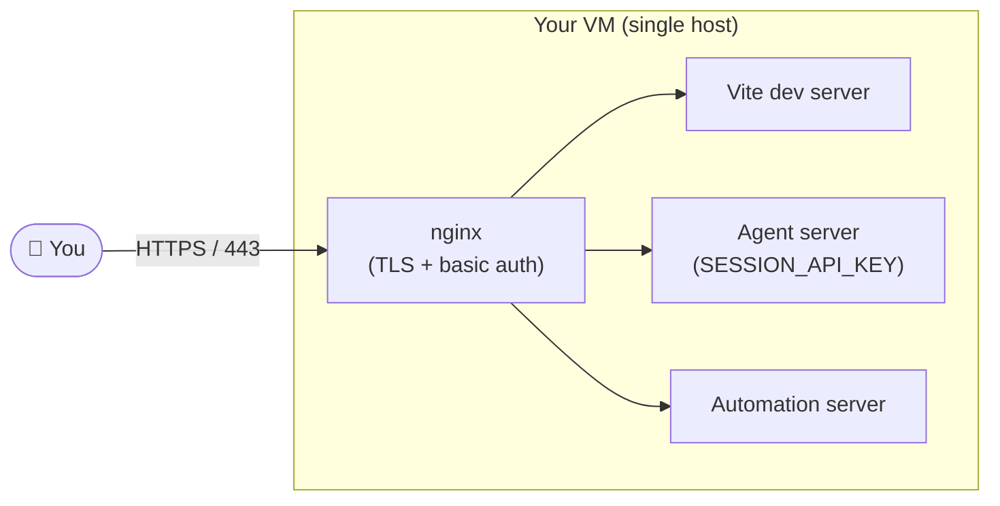

# Self-Hosting Agent Canvas on a Virtual Machine

This guide walks through running Agent Canvas on a virtual machine (VM) so you
(and only you) can reach it from anywhere via a browser.

> [!CAUTION]
> Agent Canvas drives an agent that can read and write the filesystem of the
> machine it runs on, execute shell commands, and reach the network. Anyone who
> can talk to the agent server can do the same. **Treat the VM as you would any
> machine that holds production credentials**, and lock it down before exposing
> it to the public internet. The defenses below are layered on purpose — do not
> skip any of them.

## Overview

The deployment model:



There are three lines of defense:

1. **Cloud / network firewall** — only ports 80 and 443 are reachable from the
   public internet, and ideally only from your IP allow-list.
2. **nginx HTTP basic auth** — every request must present a username/password
   before it reaches the application.
3. **`SESSION_API_KEY` on the agent server** — every `/api/*` call must also
   carry a matching `X-Session-API-Key` header. This guards against any
   misconfiguration that lets a request bypass nginx (e.g. a stray bind to
   `0.0.0.0` on the agent port).

## 1. Provision a VM and a domain

1. Provision a small Linux VM with a public IPv4 address from any cloud
   provider (DigitalOcean, AWS EC2, GCP Compute Engine, Hetzner, Linode, …).
   Ubuntu 24.04 LTS is a good default. 2 vCPU / 4 GB RAM is plenty for a single
   user; bump it up if you plan to keep many long-running conversations.
2. Register a domain (or use an existing one) and create an `A` record pointing
   to the VM's public IP — for example `canvas.example.com`. You will use this
   hostname for HTTPS and Let's Encrypt verification.
3. Verify DNS has propagated:

   ```bash
   dig +short canvas.example.com
   ```

## 2. Lock down the network

This is the most important step. Do it **before** the agent server ever
listens on a port.

Restrict inbound traffic at the cloud-provider level (DigitalOcean Cloud
Firewall, AWS Security Group, GCP firewall rule, Hetzner firewall, etc.):

- **Inbound 22 (SSH)** — restrict to your own IP / VPN CIDR. Never leave it
  open to `0.0.0.0/0` long-term.
- **Inbound 80 (HTTP)** — open to `0.0.0.0/0`. Let's Encrypt's HTTP-01
  challenge verifies from many IPs worldwide, so this needs to be world-open
  during issuance and renewal. nginx will redirect it to HTTPS.
- **Inbound 443 (HTTPS)** — this is the one you actually use. Restrict it to
  your own IP / VPN CIDR if you can. If you need it world-open (e.g. you roam
  often), the basic auth + `SESSION_API_KEY` layers below become your primary
  defense.
- **Everything else** — drop. In particular, the agent server's port and the
  Vite dev port must **not** be reachable from outside.

If you are running inside Kubernetes, use a `NetworkPolicy` to the same effect:
allow ingress on the proxy's port from a known set of CIDRs / namespaces, and
deny everything else.

For an extra host-level backstop, see
[Advanced: defense in depth](#advanced-defense-in-depth) at the end of this
document.

## 3. Install prerequisites on the VM

```bash
apt-get update
apt-get install -y nginx certbot python3-certbot-nginx apache2-utils acl curl git
# Node.js 22.x (use nvm, asdf, or NodeSource — whatever you prefer)
# uv (for the agent-server uvx runtime):
curl -LsSf https://astral.sh/uv/install.sh | sh
```

Clone the repo and install dependencies:

```bash
git clone https://github.com/OpenHands/agent-canvas.git
cd agent-canvas
npm install
```

## 4. `SESSION_API_KEY` is auto-generated

The `npm run dev:*` scripts automatically generate a random `SESSION_API_KEY`
on first run and persist it to
`~/.openhands/agent-canvas/session-api-key.txt`. The same value is wired into
both the agent server (which refuses any `/api/*` request without a matching
`X-Session-API-Key` header) and the Vite-built frontend (which sends it on
every request), and it stays stable across restarts. You don't need to
configure anything.

To rotate the key, delete the file and restart the app. To pin a specific
value instead of the auto-generated one, export `SESSION_API_KEY` before
starting the app — it takes precedence over the persisted file.

> [!IMPORTANT]
> Treat that file like an SSH private key — anyone who learns the value can
> drive your agent. Keep it on the VM and don't copy it elsewhere.

## 5. Run the app on the VM

Start Agent Canvas in dockerless mode:

```bash
npm run dev:dangerously-dockerless
```

> [!WARNING]
> `dev:dangerously-dockerless` runs the agent server **directly on the host**.
> The agent has full access to the VM's filesystem, environment, and network.
> That is exactly why the firewall, basic auth, and `SESSION_API_KEY` layers
> are non-negotiable: they are what stop a stranger from walking in and
> getting that same access.

By default the ingress listens on `127.0.0.1:8000`. Leave it bound to localhost
— nginx will be the only thing talking to it.

To keep it running across reboots, wrap it in a `systemd` unit, a `tmux`/
`screen` session, or a process manager like `pm2`. A minimal unit file:

```ini
# /etc/systemd/system/agent-canvas.service
[Unit]
Description=Agent Canvas
After=network.target

[Service]
Type=simple
WorkingDirectory=/root/agent-canvas
ExecStart=/usr/bin/npm run dev:dangerously-dockerless
Restart=on-failure
User=root

[Install]
WantedBy=multi-user.target
```

```bash
systemctl daemon-reload
systemctl enable --now agent-canvas
journalctl -u agent-canvas -f
```

## 6. Put nginx + Let's Encrypt + basic auth in front

This is the same pattern documented for any reverse-proxied service: nginx
terminates TLS, requires HTTP basic auth, and forwards to the local app.

### Create a basic-auth user

```bash
mkdir -p /root/.openhands
htpasswd -c /root/.openhands/.htpasswd <username>   # first user only; -c overwrites
# Add more users without -c:
# htpasswd /root/.openhands/.htpasswd <another-user>
```

If you keep the password file under `/root` (mode `0700`), nginx workers run
as `www-data` and cannot traverse into it. Grant just enough access with
POSIX ACLs instead of loosening `/root`:

```bash
setfacl -m u:www-data:--x /root
setfacl -m u:www-data:r-- /root/.openhands/.htpasswd
sudo -u www-data cat /root/.openhands/.htpasswd >/dev/null && echo OK
```

Re-apply these ACLs whenever the htpasswd file is recreated.

### nginx site config

Drop this at `/etc/nginx/sites-available/canvas.example.com`, replacing
`canvas.example.com` with your domain. Agent Canvas's default ingress port is
`8000`.

```nginx
server {
    listen 80;
    listen [::]:80;
    server_name canvas.example.com;

    # Allow ACME HTTP-01 challenges through without auth.
    location /.well-known/acme-challenge/ {
        auth_basic off;
        root /var/www/html;
    }

    location / {
        auth_basic "Restricted";
        auth_basic_user_file /root/.openhands/.htpasswd;

        proxy_pass http://127.0.0.1:8000;
        proxy_http_version 1.1;
        proxy_set_header Host $host;
        proxy_set_header X-Real-IP $remote_addr;
        proxy_set_header X-Forwarded-For $proxy_add_x_forwarded_for;
        proxy_set_header X-Forwarded-Proto $scheme;

        # WebSocket / SSE support — required for live agent events.
        proxy_set_header Upgrade $http_upgrade;
        proxy_set_header Connection "upgrade";
        proxy_read_timeout 3600s;
        proxy_send_timeout 3600s;
    }
}
```

Enable and reload:

```bash
ln -sf /etc/nginx/sites-available/canvas.example.com \
       /etc/nginx/sites-enabled/canvas.example.com
nginx -t && systemctl reload nginx
```

### Issue a certificate

```bash
certbot --nginx -d canvas.example.com \
    --non-interactive --agree-tos \
    --email you@example.com \
    --redirect
```

`certbot` rewrites the file to add a `listen 443 ssl` block and a 301 from
HTTP to HTTPS. The basic-auth `location /` and the
`/.well-known/acme-challenge/` exception are preserved.

`certbot` installs a systemd timer (`certbot.timer`) that auto-renews twice a
day; nginx is reloaded automatically on success.

### Verify

```bash
curl -I https://canvas.example.com/                       # → 401 Unauthorized
curl -I -u <user>:<pass> https://canvas.example.com/      # → 200
curl -I http://canvas.example.com/                        # → 301 to https
```

If you see `502 Bad Gateway`, the app on `127.0.0.1:8000` is down — check
`journalctl -u agent-canvas -f`.

## 7. Smoke-test from your laptop

Open `https://canvas.example.com/`, enter your basic-auth credentials, and
confirm that you land in Agent Canvas. Conversations, settings, and the LLM
provider picker all hit `/api/*` routes that are guarded by both basic auth
(at nginx) and `X-Session-API-Key` (at the agent server). If the API calls
return `401`, the persisted session key and the one baked into the frontend
have drifted apart — delete `~/.openhands/agent-canvas/session-api-key.txt`
and restart the app so both sides regenerate from the same value.

## Operational tips

- **Rotate the basic-auth password and `SESSION_API_KEY` periodically**,
  especially after offboarding anyone who had access. `htpasswd` changes take
  effect on the next request — no nginx reload needed. To rotate the session
  key, delete `~/.openhands/agent-canvas/session-api-key.txt` and restart the
  app.
- **Keep the VM patched** (`unattended-upgrades` is fine for Ubuntu).
- **Back up `~/.openhands-dev/` (or wherever conversations are persisted)**
  if you care about conversation history. Treat the backup as sensitive — it
  contains transcripts, secrets, and possibly auth tokens.
- **Watch the logs.** `journalctl -u agent-canvas`,
  `/var/log/nginx/access.log`, and `/var/log/nginx/error.log` are your friends
  when something looks off. Repeated 401s in the access log are normal scanner
  noise; a successful 200 from an IP you don't recognize is not.
- **Do not expose the agent server port (`8000`/`18000`) directly.** If you
  ever need to debug, tunnel it over SSH (`ssh -L 8000:127.0.0.1:8000 vm`)
  rather than opening it in the firewall.

## Advanced: defense in depth

The cloud firewall (step 2) is your primary network perimeter. If you want an
extra backstop in case it is ever misconfigured — for example, a teammate
relaxes a rule, a Terraform diff lands wrong, or you migrate to a provider
whose firewall fails open during maintenance — also enable a host-level
firewall on the VM itself.

With `ufw` on Ubuntu:

```bash
ufw default deny incoming
ufw default allow outgoing
ufw allow 22/tcp
ufw allow 80/tcp
ufw allow 443/tcp
ufw enable
```

And confirm the agent server and Vite ports are bound to `127.0.0.1` only, so
even if a firewall rule slips, those ports are not reachable from outside the
host:

```bash
ss -tlnp
# expect 127.0.0.1:8000, 127.0.0.1:18000 etc. — never 0.0.0.0:* for those
```

If you ever see one of the agent ports listening on `0.0.0.0` or `::`, stop
the app immediately and investigate before re-enabling it.
