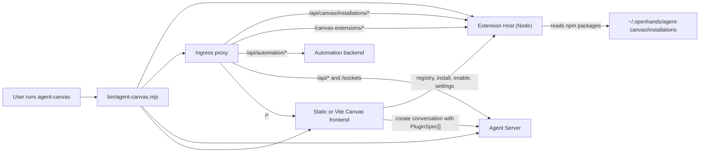

# RFC: Agent Canvas Extensions

Status: RFC, ready for review
Target: `OpenHands/agent-canvas`


## 1. Summary

Agent Canvas should ship a first-class **Extensions** system: user-installable npm packages that extend the local Canvas experience and optionally contribute components to the agent runtime through SDK-supported surfaces.

An Extension can contribute UI views, launch templates, OpenHands SDK plugin sources, MCP server templates, and system-prompt context blocks. Extensions are installed and managed by a small local Node service started by the `agent-canvas` launcher. Agent-side behavior is forwarded only through already-supported SDK surfaces — Canvas does not patch or load code inside the Agent Server.

The MVP delivers CLI install, a Packages management page, trusted same-origin extension views, dev-mode authoring with live reload, and SDK plugin / context merging on conversation launch. Marketplace, signing, sandboxed iframe views, parent-React component extensions, and agent-mediated installation are explicitly deferred. The manifest reserves a future iframe entry point so that stronger isolation can be added later without changing extension package shape.

## 2. Motivation

Today the Canvas surface area is fixed at build time. There is no supported path for users, partners, or our own product teams to ship a new launch template, a curated MCP setup, a UI view, or a packaged set of skills without modifying and rebuilding the application. This blocks three things we want:

1. **Ecosystem.** Partners and the community cannot extend Canvas without forking.
2. **Vertical solutions.** We cannot ship product-specific launch flows (GitHub review, infra ops, data analysis) as composable add-ons that share a single distribution mechanism.
3. **Agent-built tools.** A future where an agent builds a Canvas extension during a conversation and proposes installing it is a meaningful product differentiator. Extensions are the substrate that makes that possible.

The system must preserve the existing security and operational boundaries between Canvas (a local client + launcher) and the Agent Server (which may be local, remote, cloud, or ACP-backed).

## 3. Product Vocabulary

- **Extension** — an Agent Canvas npm package with an `agent-canvas.extension.json` manifest.
- **Extension Host** — local Node HTTP service launched by `agent-canvas`; installs, validates, and serves extension packages.
- **SDK Plugin** — the OpenHands SDK plugin format (`.plugin/plugin.json`), containing skills, hooks, MCP config, agents, and slash commands. Extensions may bundle or reference SDK plugins.
- **MCP Server** — external tool server config installed into agent settings.
- **Skill** — an OpenHands skill loaded by the SDK; usually delivered via an SDK plugin rather than copied into user skill directories.

User-facing UI should use the word "Extension." Avoid "plugin" in the Canvas product surface because the SDK already owns that term.

## 4. Goals

- Install from npm package names, version ranges, tarballs, or local paths.
- Works when the user globally installs Agent Canvas and runs `agent-canvas`.
- Supports CLI install/manage commands, persisted enablement, and a process-level diagnostic kill switch.
- Keeps the Agent Server unmodified for MVP.
- Aligns with the OpenHands SDK plugin format rather than inventing a competing format.
- Lets one extension package ship UI plus agent-runtime descriptors.
- Third-party executable code is opt-in and auditable.
- Local development works without rebuilding Agent Canvas.
- Preserves current Skills, MCP, Launch, Automations, and Settings flows.

## 5. Non-Goals

- No extension may patch or monkeypatch the Agent Server.
- No extension may register server-side tools except through SDK-supported plugin/MCP mechanisms.
- No stable extension API may expose Canvas internals, parent React components, or DOM mutation hooks. MVP browser modules are trusted same-origin code, so DOM access is a trust concern rather than an enforceable sandbox boundary.
- No repository-local files may modify the running Canvas browser experience simply because a conversation is attached to that repository.
- No npm install scripts run by default during extension installation.
- No public marketplace, ratings, payments, reviews, or remote trust service in the first PRs.

## 6. Prior Art

Two existing systems informed this design.

**Hermes (Nous Research).** We adopt: explicit opt-in enablement, three lifecycle states (enabled/disabled/installed), schema-validated manifests with capability declarations, multiple narrow contribution surfaces instead of one all-powerful hook API, good diagnostics (`list`, `doctor`, debug logs, skipped reasons), and explicit secret/env declarations. We do **not** adopt Hermes' direct `ctx.register_tool()` model or its automatic loading of user/project code — Canvas should not be an agent-server plugin loader, and tool override belongs in SDK governance.

**Pi (pi.dev).** We adopt: a single generic `install` verb that detects artifact type, multiple authoring shapes (single directory, packaged module, package wrapping skills/SDK plugins/MCP templates), a developer reload story for explicitly registered local extensions, and clear language that local extensions are code requiring trust. We do **not** adopt Pi's repository-auto-discovery of extensions, its in-process tool registration, or its built-in tool overriding — those collapse the local/remote runtime boundary that Canvas must preserve.

A prior internal prototype (`dv/addons-clean-v1`) contributed the typed host SDK shape, manifest validation, stable extension IDs, route host with error boundary, sidebar ordering, and path-normalization patterns. It is not merge-ready: it assumes a Vite build-time registry, which a globally-installed CLI cannot regenerate per install. An empty `src/addons/` directory remains on `main` from earlier exploration and will be removed as part of PR 0 (see §25).

## 7. Architecture

Three layers, each with a clear boundary:



### 7.1 Extension Host (local Node service)

The Extension Host runs in every launcher mode that supports extensions: the packaged `agent-canvas` CLI, `npm run dev`, `npm run dev:minimal`, and `npm run dev:static`. It owns:

- npm package install/update/remove (always with `--ignore-scripts` by default).
- Manifest discovery and schema validation.
- Local package cache and `package-lock.json` for reproducibility.
- Enabled/disabled state.
- Extension settings and non-secret config.
- Serving extension browser assets.
- Serving a registry JSON document to the frontend.
- Producing launch contributions for the frontend.
- Diagnostics and logs.

The Extension Host **must not** proxy arbitrary requests to the Agent Server. When it exposes Agent Server data through the supported extension API, it does so through narrow, typed, permission-declared capabilities.

### 7.2 Frontend Runtime

The Canvas frontend owns:

- Extension management UI (the Packages page).
- Navigation for extension views.
- The extension view host that mounts trusted extension browser modules into Canvas-owned route containers (with a reserved future iframe runtime; see §12.1).
- Installation consent UX, permission display, secret setup prompts.
- Settings forms generated from extension JSON Schemas.
- Merging enabled extension launch contributions into conversation create payloads.
- Toasts, query invalidation, and error boundaries for extension actions.

### 7.3 Agent Runtime (Agent Server)

The Agent Server is unchanged for MVP. Canvas treats it as a black box and only uses documented request fields:

- `Conversation(..., plugins=[PluginSource(...)])` via the create-conversation payload.
- `AgentContext.system_message_suffix`, already used by Canvas for the `<RUNTIME_SERVICES>` block ([src/api/agent-server-adapter.ts:91-225](src/api/agent-server-adapter.ts:91)).
- Existing MCP settings APIs.
- Existing skills APIs where supported.

## 8. CLI UX

### Global install and launch

```sh
npm install -g @openhands/agent-canvas
agent-canvas
```

### Install

`agent-canvas install` is a single generic verb that detects what is being installed and routes through the matching installer.

```sh
agent-canvas install @acme/agent-canvas-github
agent-canvas install @acme/agent-canvas-github@1.2.3
agent-canvas install ./local-extension
agent-canvas install ../my-extension --dev
```

Detection order:

1. `package.json` has `agentCanvas.manifest` or an `agent-canvas.extension.json` file is present → Agent Canvas Extension.
2. `.plugin/plugin.json` is present → OpenHands SDK plugin reference.
3. `SKILL.md` is present → skill.
4. Future MCP template manifest → MCP template.
5. Multiple markers present → the explicit Agent Canvas Extension manifest wins (it may intentionally wrap SDK plugin, skill, or MCP contributions).

For extensions, install validates the manifest, shows permissions, installs with scripts denied by default, and enables the extension after consent. Non-interactive flags:

```sh
agent-canvas install @acme/agent-canvas-github --yes
agent-canvas install @acme/agent-canvas-github --no-enable
agent-canvas install @acme/agent-canvas-github --install-scripts=allow
```

Default is `--install-scripts=deny` (npm `--ignore-scripts`).

### Management

```sh
agent-canvas list
agent-canvas list extensions
agent-canvas enable acme.github
agent-canvas disable acme.github
agent-canvas remove acme.github
agent-canvas update acme.github
agent-canvas doctor
```

These commands operate without starting the full UI stack. Type filters keep the command useful once skills/MCP/plugins share the installer.

### Process kill switch

MVP enablement is persistent only: an artifact is active when it is installed and enabled in `config.json`. The one process-local exception is a support/debugging kill switch:

```sh
agent-canvas --disable-extensions
```

This flag starts Canvas with all extension contributions ignored for that process. It does not create registry state, does not mutate `config.json`, and does not support selective run-only enablement. Per-run exact sets (`--extensions ...`), single-extension run overrides, and `install --run-only` are deferred until there is a concrete test/support workflow that needs them.

## 9. Installable Artifact Store

Canvas already stores client state at `~/.openhands/agent-canvas/` (session API keys, conversations, workspaces, automations DB, bash events). Installable artifacts live as a sibling so users have one obvious place to inspect and back up Canvas state:

```text
~/.openhands/agent-canvas/installations/
  package.json
  package-lock.json
  config.json
  artifacts.json
  logs/
  dev/
  node_modules/
```

`package.json` is a private package used only to install npm-backed artifacts. `artifacts.json` records detected artifact type, installed package/path, manifest location, state, and diagnostics. `config.json` records enable/disable state and non-secret settings:

```json
{
  "schemaVersion": 1,
  "enabled":  { "extensions": ["acme.github"], "plugins": [], "skills": [], "mcpTemplates": [] },
  "disabled": { "extensions": [], "plugins": [], "skills": [], "mcpTemplates": [] },
  "settings": { "acme.github": { "defaultBranch": "main" } }
}
```

Secrets are never stored in this file. They are saved through the existing Agent Server secrets service.

All installation is local to the Agent Canvas client. `agent-canvas install` never installs into a remote Agent Server, cloud sandbox, or team backend.

## 10. Npm Package Contract

Each extension package exposes its manifest through `package.json`:

```json
{
  "name": "@acme/agent-canvas-github",
  "version": "0.1.0",
  "type": "module",
  "agentCanvas": { "manifest": "./agent-canvas.extension.json" },
  "files": ["agent-canvas.extension.json", "dist", "agent"]
}
```

The manifest path must resolve inside the package root. Path traversal is rejected.

## 11. Manifest Schema

`agent-canvas.extension.json`:

```json
{
  "$schema": "https://schemas.openhands.dev/agent-canvas/extension.v1.json",
  "schemaVersion": 1,
  "id": "acme.github",
  "displayName": "GitHub Workspace Tools",
  "version": "0.1.0",
  "description": "GitHub launch helpers, MCP setup, and PR review workflows.",
  "publisher": { "name": "Acme", "url": "https://example.com" },
  "license": "MIT",
  "repository": "https://github.com/acme/agent-canvas-github",
  "compatibility": {
    "agentCanvas": ">=1.0.0-alpha.4 <2.0.0",
    "extensionApi": 1
  },
  "activationEvents": ["onStartup"],
  "permissions": {
    "ui": ["views"],
    "agent": ["sdkPlugins", "context"],
    "mcp": ["templates"],
    "network": ["https://api.github.com"]
  },
  "browser": {
    "module": "./dist/index.js"
  },
  "contributes": {
    "views": [
      {
        "id": "dashboard",
        "title": "GitHub",
        "route": "/github",
        "navigation": { "location": "extensions", "order": 300, "icon": "./dist/github.svg" }
      }
    ],
    "agentPlugins": [
      { "id": "github-pr-review", "source": "./agent/github-pr-review", "autoInclude": "manual" }
    ],
    "mcpServers": [
      {
        "id": "github",
        "title": "GitHub",
        "template": { "kind": "stdio", "command": "npx", "args": ["-y", "@modelcontextprotocol/server-github"] },
        "requiredSecrets": ["GITHUB_TOKEN"]
      }
    ],
    "launchTemplates": [
      {
        "id": "review-pr",
        "title": "Review a Pull Request",
        "prompt": "Review the selected pull request and propose changes.",
        "requiredAgentPlugins": ["github-pr-review"],
        "requiredMcpServers": ["github"]
      }
    ],
    "conversationContext": [
      {
        "id": "github-guidance",
        "title": "GitHub workflow guidance",
        "autoInclude": "manual",
        "content": "When working with GitHub, prefer the configured GitHub MCP server for issue and pull request metadata."
      }
    ]
  },
  "configuration": {
    "properties": {
      "defaultBranch": { "type": "string", "default": "main", "title": "Default branch" }
    }
  },
  "secrets": [
    {
      "name": "GITHUB_TOKEN",
      "title": "GitHub token",
      "description": "Used by the GitHub MCP server.",
      "url": "https://github.com/settings/tokens",
      "secret": true
    }
  ]
}
```

**Required fields:** `schemaVersion`, `id`, `displayName`, `version`, `compatibility.agentCanvas`, `compatibility.extensionApi`.

**ID rules:** `^[a-z0-9][a-z0-9._-]*[a-z0-9]$`. Package names and extension IDs need not match. Duplicate enabled IDs are rejected.

### 11.1 `browser` runtime modes

The `browser` declaration accepts one of two shapes. The shape selects the runtime mode; the two are mutually exclusive and the validator rejects manifests that set both.

| Field | Status | Runtime |
|---|---|---|
| `browser.module` | **Active (MVP).** | Browser-ready ESM module loaded into a Canvas-owned DOM container. The extension exports a `mount()` entry point and owns its rendering stack. |
| `browser.entry` | **Reserved, not yet supported.** | Future HTML document loaded into a sandboxed iframe (`sandbox="allow-scripts allow-forms allow-downloads"`, no `allow-same-origin`) with a postMessage RPC bridge mirroring the same context API. |

The MVP implements only `browser.module`. The `browser.entry` field is reserved in the schema from day one so that a future iframe runtime can ship without a manifest schema bump, and so that extension authors can read the design intent today.

**Why reserve `browser.entry` if the MVP only uses `browser.module`?** Same-origin browser modules are the smallest useful runtime for first-party and trusted partner extensions: they work in the globally installed CLI, avoid postMessage infrastructure, and let extension authors choose their own bundler/framework. They are **not** a sandbox. Once enabled, inline browser code should be treated as trusted local code with the same browser-origin privileges as Canvas itself (see §19). An iframe sandbox becomes valuable in two future scenarios we want to leave room for:

1. A community extension marketplace where untrusted third-party code needs stronger isolation than install-time consent provides.
2. Extensions that intentionally ship their own framework or rendering stack and benefit from owning their own document.

Designing the manifest, asset-serving routes, and runtime API around an async, host-mediated surface from the start means the iframe runtime is a future additive PR — not a redesign. Specifically:

- The API in §13 is defined async-only, so the same interface is satisfiable by direct function calls (inline mode) or by a postMessage proxy (iframe mode).
- The `/canvas-extensions/:id/*` asset-serving route already exists in §17 and serves whichever bundle the extension declares.
- Manifest validation in PR 0 will accept `browser.entry` as a syntactically valid field but emit a validation error (`browser.entry is reserved and not yet supported`) until the iframe runtime ships, preventing accidental shipping of extensions that depend on an unimplemented mode.

This is the minimum coverage needed today to keep the iframe option open later at low cost.

## 12. Contribution Types

### 12.1 `views`

Routes rendered by Canvas at `/extensions/:extensionId/:viewId/*`.

**MVP runtime: trusted same-origin browser module.** The extension's `browser.module` is loaded by the Canvas frontend with dynamic `import()` and mounted into a Canvas-owned DOM container at the view route. The extension exports a `mount()` function, receives the typed context (§13), and owns rendering inside that container. It may use React, Svelte, vanilla DOM, or another framework as long as the shipped module is browser-ready. It should use Canvas CSS variables/design tokens and host-provided APIs instead of importing Canvas internals.

Inline extension code runs in the same browser origin as Canvas. That is intentional for MVP, and it means runtime capability declarations are a consent, audit, and UX contract rather than a hard browser sandbox. A trusted inline extension can technically call same-origin routes if it has access to the active session credentials, inspect browser state available to Canvas, and manipulate page DOM. The Packages UI must communicate that trust model clearly before enablement. Strong isolation is deferred to the future `browser.entry` iframe runtime.

**Browser module packaging contract.**

- `browser.module` must point to a built ESM file that a browser can import directly.
- The Extension Host serves static files only; it does not transpile TypeScript/JSX or run bundlers for installed packages.
- Runtime imports must be relative URLs inside the extension asset tree or bundled into the module. Bare runtime imports such as `react`, `@heroui/react`, or `@openhands/agent-canvas/extensions` are rejected for MVP because the packaged CLI cannot guarantee a Vite resolver or shared dependency graph.
- Type-only imports from `@openhands/agent-canvas/extensions` are allowed in author source and erased by the extension's build.
- The default export shape is:

```ts
export default {
  async mount({ root, context }: AgentCanvasExtensionMountParams) {
    // Render into `root`.
    return {
      dispose() {
        // Optional cleanup.
      },
    };
  },
};
```

This DOM-island contract avoids React shared-instance problems in static builds while keeping the future iframe API close: the same async context can later cross a postMessage boundary.

**Reserved future runtime: sandboxed iframe.** The manifest reserves `browser.entry` (§11.1) for a future iframe runtime intended for untrusted third-party extensions (e.g., a community marketplace). The iframe sandbox would be `sandbox="allow-scripts allow-forms allow-downloads"` with no `allow-same-origin`, communicating with the parent through a postMessage RPC bridge that exposes the same context API. This is not implemented in MVP; declaring it now keeps the option open without committing implementation cost today.

### 12.2 `agentPlugins`

Maps to OpenHands SDK plugin sources. Fields: `id`, `source` (package-relative path, GitHub shorthand, Git URL, or absolute path for dev mode), `ref` (optional branch/tag/commit), `repoPath` (optional subdirectory), `autoInclude` (`manual` | `enabled` | `always`; default `manual`).

Resolution:

- Package-relative paths are converted by the Extension Host to absolute paths inside the installed npm package.
- Remote sources pass through as SDK `PluginSource`.
- Local paths are allowed only when explicitly installed with `--dev` or through `agent-canvas install <path>`.

The current frontend `PluginSpec.parameters` field is collected by `/launch` but stripped by [agent-server-adapter.ts:707-711](src/api/agent-server-adapter.ts:707) before the create-conversation payload is sent. MVP extension behavior must not depend on arbitrary plugin parameters.

### 12.3 `mcpServers`

Extensions provide MCP templates, never silent installs. The UI shows required MCPs before launch and reuses the existing `InstallServerModal` pattern.

**ACP constraint.** [src/routes/mcp.tsx:38-47](src/routes/mcp.tsx:38) currently disables MCP management while an ACP agent is active because the SDK rejects `mcp_config` on `ACPAgent` init. Extension MCP contributions inherit this guard.

### 12.4 `launchTemplates`

Reusable launch presets shown on home, extension pages, or automation setup. May reference required MCP IDs, required agent plugin IDs, optional context blocks, initial prompt text, and workspace requirements.

### 12.5 `conversationContext`

Context blocks may be appended to `AgentContext.system_message_suffix` only after explicit user enablement. Canvas renders all extension context inside a single block, appended after the existing `<RUNTIME_SERVICES>` block:

```text
<AGENT_CANVAS_EXTENSIONS>
The user enabled the following Agent Canvas extensions for this conversation.

* acme.github/github-guidance
  When working with GitHub, prefer the configured GitHub MCP server for issue and pull request metadata.
</AGENT_CANVAS_EXTENSIONS>
```

Extension context **must not** be merged into `conversationInstructions`; that turns extension guidance into user-message content. An explicit `extensionSystemSuffix` option will be added to the conversation adapter so runtime services and extension context compose in one place.

### 12.6 `configuration` and `secrets`

`configuration` uses JSON Schema; values are stored in the Extension Host's `config.json`. `secrets` are declarations only; values are stored through the existing `SecretsService`.

## 13. Extension Runtime API

Extensions receive a typed context object exposing host-mediated operations. In MVP, the context is passed to the extension's `mount()` function along with a Canvas-owned DOM root. The API is defined async-only so that a future iframe runtime can satisfy the same interface via a postMessage RPC bridge without changing extension authoring.

MVP module shape:

```ts
interface AgentCanvasExtensionMountParams {
  root: HTMLElement;
  context: AgentCanvasExtensionContext;
}

interface AgentCanvasExtensionDisposable {
  dispose(): void | Promise<void>;
}

interface AgentCanvasExtensionModule {
  mount(
    params: AgentCanvasExtensionMountParams,
  ):
    | void
    | AgentCanvasExtensionDisposable
    | Promise<void | AgentCanvasExtensionDisposable>;
}
```

MVP API surface:

```ts
interface AgentCanvasExtensionContext {
  extension: { id: string; version: string; settings: Record<string, unknown> };
  theme: { colorScheme: "dark" | "light" };
  navigation: {
    navigate(to: string, options?: { replace?: boolean }): Promise<void>;
    openExternal(url: string): Promise<void>;
  };
  ui: {
    toast(message: string, options?: { tone?: "success" | "error" }): Promise<void>;
  };
  conversations: {
    list(): Promise<unknown[]>;
    current(): Promise<unknown | null>;
  };
  launch: {
    startConversation(options: unknown): Promise<{ conversationId: string }>;
  };
  settings: {
    readExtensionSettings(): Promise<Record<string, unknown>>;
    patchExtensionSettings(value: Record<string, unknown>): Promise<void>;
  };
}
```

There is **no** supported generic `agentServer.request(path)`. The repo already routes Agent Server traffic through typed service wrappers; the extension surface follows the same pattern with named, permission-declared capabilities. For MVP inline browser modules, this is an API support boundary rather than a browser security boundary (see §19).

## 14. Shared Type Contract

Initial home: `src/extensions/types.ts`, exported as `@openhands/agent-canvas/extensions` once stable. (PR 0 will collapse generic installable-artifact types and extension-specific types into a single directory; splitting them across `src/installations/` and `src/extensions/` is premature before any consumer exists.)

Initial types:

```ts
export interface AgentCanvasExtensionManifest {
  schemaVersion: 1;
  id: string;
  displayName: string;
  version: string;
  description?: string;
  publisher?: { name: string; url?: string };
  compatibility: { agentCanvas: string; extensionApi: number };
  permissions?: ExtensionPermissions;
  browser?: ExtensionBrowserContribution;
  contributes?: ExtensionContributions;
  configuration?: ExtensionConfigurationSchema;
  secrets?: ExtensionSecretDeclaration[];
}

export interface AgentCanvasExtensionMountParams {
  root: HTMLElement;
  context: AgentCanvasExtensionContext;
}

export interface AgentCanvasExtensionDisposable {
  dispose(): void | Promise<void>;
}

export interface AgentCanvasExtensionModule {
  mount(
    params: AgentCanvasExtensionMountParams,
  ):
    | void
    | AgentCanvasExtensionDisposable
    | Promise<void | AgentCanvasExtensionDisposable>;
}

export type InstallableArtifactKind =
  | "extension"
  | "sdk-plugin"
  | "skill"
  | "mcp-template";

export interface InstallableArtifactRegistryEntry {
  id: string;
  kind: InstallableArtifactKind;
  packageName: string;
  version: string;
  state: "enabled" | "disabled" | "installed" | "invalid";
  manifest: AgentCanvasExtensionManifest | Record<string, unknown>;
  assetBaseUrl?: string;
  diagnostics: ExtensionDiagnostic[];
}
```

`registerTool`, parent-React component registration, and Canvas-internal imports are intentionally absent from the MVP public contract.

## 15. Permissions Model

Permission groups:

- `ui.views` — render trusted same-origin browser-module views.
- `ui.commands` — register commands.
- `agent.sdkPlugins` — include SDK plugins in conversation launches.
- `agent.context` — append extension context to system suffix.
- `mcp.templates` — offer MCP server templates.
- `agentServer.read` / `agentServer.write` — read/write Agent Server APIs through the Canvas broker.
- `secrets.declare` — request secret setup.
- `network` — list of external origins the extension says it may contact (advisory; not strictly enforced by CSP in MVP).

User consent shows: package name + version, extension ID, publisher, repository, enabled contribution types, required secrets, whether trusted same-origin browser code is included, whether SDK plugins or context blocks can affect new conversations, whether the contribution works only with a local Agent Server, and any new or expanded permissions on update.

### 15.1 Extension States

Every artifact in the registry has exactly one persisted state:

| State | Active by default? | Typical entry point |
|---|---|---|
| `enabled` | Yes | Consent flow at install, or `agent-canvas enable <id>` |
| `disabled` | No | `agent-canvas disable <id>`, install with `--no-enable`, or a permission-expanding update that drops the artifact back to manual re-approval |
| `installed` | No | Installed but never enabled |
| `invalid` | No | Manifest failed validation; `diagnostics[]` on the entry explains why |

**Conflict rule.** Disabled wins over enabled if a manual config edit creates both persisted entries for the same ID. The process-level `--disable-extensions` kill switch suppresses all extension loading for the current run but does not create a registry state.

## 16. Conversation Runtime Awareness

Agent Canvas is always local. The active Agent Server backend may be local, remote, OpenHands Cloud, or an ACP subprocess. The launch path computes a runtime compatibility report before applying extension contributions.

Runtime classes:

- `canvas-local` — browser UI and Extension Host only. Always available.
- `agent-server-local` — Agent Server process is local to this Canvas stack and can read local paths.
- `agent-server-remote` — remote Agent Server; local extension package paths are not visible.
- `cloud-runtime` — OpenHands Cloud; local paths are not visible to the sandbox.
- `acp-runtime` — agent is an ACP subprocess; MCP and context follow existing ACP rules.

Compatibility:

- Browser views and extension settings UI: `canvas-local`.
- Context blocks: any runtime that accepts `system_message_suffix`.
- Remote SDK plugin sources: any runtime that accepts `plugins`.
- Package-relative / local SDK plugin paths: `agent-server-local` only.
- MCP templates: where existing MCP settings work (ACP inherits the existing guard).
- Secrets: where the active backend's secrets service accepts them.

Incompatible contributions are skipped with a disabled reason shown before launch. Local filesystem paths are never sent to remote/cloud runtimes.

### 16.1 Local-filesystem detection

`backend.kind === "local"` is **not sufficient** — a local-protocol backend can point at a remote host. The launcher will issue an explicit **`localInstallStoreReadable` capability flag** to the frontend on startup. The flag is true only when the Agent Server process was started by this same `agent-canvas` invocation and shares the local filesystem with `~/.openhands/agent-canvas/installations/`. Without that flag, package-relative SDK plugin paths are disabled and the UI shows a disabled-reason chip on the affected launch template.

### 16.2 Runtime-location note

When extension agent-side contributions are included, Canvas appends a short runtime-location note alongside `<RUNTIME_SERVICES>` and `<AGENT_CANVAS_EXTENSIONS>`:

```text
<AGENT_CANVAS_RUNTIME>
Agent Canvas extensions are installed in the local Agent Canvas client.
Conversation runtime: agent-server-remote.
Do not assume local extension package paths are available inside the runtime.
Only use extension-provided capabilities explicitly listed in this prompt or exposed through runtime tools/settings.
</AGENT_CANVAS_RUNTIME>
```

Contains no secrets. Local absolute paths are included only when the runtime is local and the path is intentionally part of an SDK plugin source.

## 17. API Routes

Mounted through ingress **before** `/api/*` is forwarded to the Agent Server, using the same precedence pattern already in place for `/api/automation/*` ([scripts/dev-with-automation.mjs](scripts/dev-with-automation.mjs) around the existing automation routes):

```text
GET    /api/canvas/installations/registry
GET    /api/canvas/installations/diagnostics
POST   /api/canvas/installations/install
POST   /api/canvas/installations/:id/enable
POST   /api/canvas/installations/:id/disable
DELETE /api/canvas/installations/:id
PATCH  /api/canvas/installations/:id/settings
GET    /api/canvas/installations/launch-contributions
GET    /canvas-extensions/:id/*assetPath
```

Note the consistent `/api/canvas/installations/*` prefix for management — including `launch-contributions`, which was previously inconsistent. Asset serving keeps its own `/canvas-extensions/*` prefix because it serves untrusted third-party static files and benefits from being easy to identify in logs and CSP rules.

The `install` route uses the same artifact detector as `agent-canvas install`. Mutating routes require the existing session API key.

Frontend code must call these routes only through a dedicated `src/api/extensions-service.ts` wrapper. Because the route prefix begins with `/api/` but targets the local Extension Host rather than the Agent Server, PR 2 must update `src/api/no-direct-agent-server-calls.test.ts` with a narrow allowlist entry for that wrapper, mirroring the existing automation-service exception. This keeps the `/api/canvas/installations/*` ingress shape while preserving the repo rule that ordinary Agent Server traffic goes through `@openhands/typescript-client`.

**Routing requirement:** the Extension Host route table must be implemented for every launch mode in the same PR that starts the host (Vite dev proxy, automation ingress, static serving path, and packaged CLI).

Registry response:

```json
{
  "schemaVersion": 1,
  "extensionApi": 1,
  "artifacts": [
    {
      "id": "acme.github",
      "kind": "extension",
      "packageName": "@acme/agent-canvas-github",
      "version": "0.1.0",
      "state": "enabled",
      "manifest": {},
      "assetBaseUrl": "/canvas-extensions/acme.github/",
      "diagnostics": []
    }
  ]
}
```

## 18. Conversation Launch Integration

An extension contribution merge step runs before `buildStartConversationRequestWithEncryptedSettings()`:

1. `useCreateConversation()` receives optional extension launch selections.
2. `AgentServerConversationService.createConversation()` asks `ExtensionsService.getLaunchContributions()` for globally enabled contributions (unless extensions are disabled).
3. Merge selected/auto-included SDK plugin specs with existing `plugins`.
4. Merge selected extension context into the new `extensionSystemSuffix` adapter option.
5. `agent-server-adapter.ts` appends extension context to `AgentContext.system_message_suffix`.
6. Existing payload creation sends `plugins` and no new server-specific fields.

Merge rules:

- Explicit `plugins` from `/launch` come first.
- Extension plugins follow in deterministic order: extension navigation order, then manifest order.
- Duplicate plugin sources are deduped by resolved `source/ref/repo_path` tuple.
- Extension context is deduped by `extensionId/contextId`.
- MCP templates are never auto-installed during conversation create.

## 19. Security Posture

**Threats.** Malicious browser JS in npm packages. Arbitrary code via npm install scripts. Rapidly changing unreviewed dev folders. Extension UI reading same-origin Canvas state or calling same-origin routes. Prompt injection via extension context. SDK plugin hooks/MCP servers in the agent runtime. Path traversal via manifests. Social engineering via agent-mediated install proposals (future).

**Trust model for MVP browser code.** Inline `browser.module` code is same-origin trusted code. If enabled, it can exercise the same browser privileges as Canvas itself, including calling local Canvas/Agent Server routes when it has the required session credentials. The capability API is still valuable as the supported integration surface, but it is not a security boundary in MVP. The consent UI must say this plainly: enable browser-code extensions only from sources the user trusts.

**MVP controls.**

- `npm install --ignore-scripts` by default.
- Manifest path validation; all relative paths must stay inside package root.
- Explicit enablement; explicit permission display at install time.
- Explicit registration for dev source folders (never auto-discovered).
- Host-mediated extension API for supported integrations; permissions are consent/audit metadata, not hard same-origin browser enforcement.
- Path validation for extension asset serving.
- No automatic MCP installation.
- No repository-local extension discovery for Canvas UI extensions.
- Visible diagnostics and logs.

**Future controls.** Sandboxed iframe runtime for untrusted/marketplace extensions (manifest support reserved as `browser.entry`; see §11.1 and §12.1). Signature/provenance verification. Lockfile integrity display. Enterprise allowlist/denylist policy. Per-extension CSP. Scanner integration before install. Trust labels for first-party extensions.

## 20. Operational Semantics

**Install defaults.** Interactive install validates, shows permissions, enables on confirmation. `--no-enable` installs disabled. `--yes` skips prompts but still fails closed on new permissions unless paired with an explicit non-interactive policy flag. Install scripts denied by default.

**Update defaults.** Updates preserve enabled/disabled state only when the manifest ID is unchanged and permissions do not expand. If an update adds agent-affecting contributions, new secrets, broader network origins, or new write permissions, the artifact moves to `installed`/disabled until re-approval. Downgrades require explicit CLI input and are recorded in diagnostics.

**Uninstall defaults.** `agent-canvas remove <id>` disables and removes the package; extension settings are preserved by default; secrets are never deleted by default; MCP servers / skill settings previously installed via an extension are not removed silently. `--purge` removes local settings and cached package data. `--purge-secrets` is separate and explicit.

**Collision handling.** Artifact IDs must be unique. Installing a package whose manifest ID already exists updates it if the package identity matches, otherwise fails with a collision diagnostic. Two enabled artifacts cannot contribute the same view route, launch template ID, or context block ID under the same namespace.

**Failure handling.** Invalid manifest → `invalid` state with diagnostics. Missing `browser.module` → keep installed, disable affected UI contribution. Manifest declares the reserved `browser.entry` field → `invalid` state with a "reserved, not yet supported" diagnostic. Extension view error → host-level error boundary and cleanup around the DOM container, rest of Canvas stays alive. Incompatible SDK plugin source → skip with preflight warning. Missing required secret → setup action surfaced, dependent contribution withheld. Extension Host unavailable → Canvas loads in degraded mode with a banner.

**Package inspection rule.** The Extension Host never imports extension Node code to inspect an artifact. It reads only static files: `package.json`, `agent-canvas.extension.json`, `.plugin/plugin.json`, `SKILL.md`, and static asset paths. Extension-authored code runs only as the inline browser module loaded into the Canvas frontend, or as SDK/MCP/runtime code, in both cases only after explicit consent.

## 21. Development Mode Authoring

Dev mode lets contributors and agents iterate on extensions without publishing to npm or rebuilding Canvas. It is available only in development-capable stacks (`npm run dev`) and documented in contributor docs, not the end-user install path.

### CLI

```sh
agent-canvas install ../my-extension --dev
agent-canvas dev-extension register ../my-extension
agent-canvas dev-extension unregister local.my-extension
agent-canvas dev-extension list
```

### Registration store

```text
~/.openhands/agent-canvas/installations/dev/dev-extensions.json
```

Each entry records absolute source path, manifest path, registration timestamp, and workspace-scoping. Auto-discovery of arbitrary repo folders is forbidden.

### Behavior

- Watch registered dev folders for changes (`fs.watch`; `chokidar` only if needed).
- Re-validate manifest on change.
- Serve assets directly from the source folder.
- Append a cache-busting version to the browser-module URL after changes so dynamic imports receive fresh code.
- Dispose and remount only the affected extension view when its module changes; avoid reloading the parent Canvas app.
- Surface manifest/build errors in the Packages page and extension view.
- The extension authoring project owns its build/watch command. Canvas watches declared output files and source manifests; it never runs package install scripts automatically and must ask before any package-manager command.
- Never hot-reload SDK plugin / tool state into an already-running conversation; a new conversation is required for agent-side contribution changes.

### Safety rules

Dev extensions run as trusted same-origin browser modules, just like installed MVP extensions. They are local code with full browser-origin access once enabled, so there is no automatic enablement from repository contents. Each new dev folder requires explicit user approval, and dev mode is visibly labeled in the UI with source path and warning copy.

### Promotion

```sh
agent-canvas install ../my-extension
```

or "Promote to Installed Extension" from the Packages page. Promotion installs into the normal store, freezes version/provenance, and disables dev watch for that extension.

## 22. Agent-Mediated Installation (post-MVP)

The future flow: an agent builds an extension in the workspace, proposes installing it, the local UI asks the user for approval, and the local Extension Host performs the install. The agent never installs directly.

**Source types** the proposal mechanism will support:

- `npm` (`{ packageName, version }`).
- `conversation-artifact` (`{ conversationId, path, sha256? }`) — Canvas downloads via existing conversation file APIs. Safe for any backend.
- `local-path` (`{ path }`) — only when `localInstallStoreReadable` is true.

**New pieces required.** A Canvas-facing `canvas_extension.propose_install` tool module (proposal-only, no server-side install executor); a frontend handler for proposal ActionEvents with an approval modal; an Extension Host endpoint accepting an approved proposal and re-validating; conversation-artifact download path; permission-diff UI; registry refresh and extension-view remount after install.

**Safety rules.** Proposal alone is not sufficient — user approval required. No write-capable Extension Host key in `<RUNTIME_SERVICES>` or the prompt. The agent cannot call `/api/canvas/installations/install` directly. Extension Host re-validates the downloaded artifact; proposal payload is advisory. Conversation artifacts are size-limited and checksum-verified when `sha256` is provided. Permission expansion follows the same re-approval rules as CLI updates.

This is not part of PR 0 or PR 1. It becomes feasible after the local install store, artifact detector, Extension Host, and Packages UI exist.

## 23. Upstream Dependencies

MVP requires **zero broad Agent Server changes**. Three things to confirm against the current pinned SDK before PR 4:

1. Agent Server create-conversation accepts `plugins` in the shape of SDK `PluginSource`.
2. `AgentContext.system_message_suffix` remains accepted for both `Agent` and `ACPAgent`.
3. SDK plugin local-path loading works from the host path Canvas passes.

Nice-to-have, not blockers: resolved plugin refs in conversation info for audit; structured plugin load diagnostics as conversation events; `PluginSource.parameters` if the SDK decides to support it; a validation endpoint for plugin manifests; server-owned SDK plugin management APIs.

Out of scope upstream: a generic server-side Canvas extension loader; server-side npm package installation; arbitrary frontend hook execution in the Agent Server; tool-override APIs for third-party Canvas packages.

## 24. Frontend UX

### Extensions hub

Sections:

- Skills
- MCP Servers
- Packages

`/plugins` redirects to `/extensions/packages` (or becomes Packages) while retaining old bookmarks.

Packages page sections: Enabled · Installed but disabled · Invalid · Install from npm/package spec · Developer extension path.

Each extension card shows: display name, package name, version; state; contribution badges; required secrets status; enable/disable/remove actions; diagnostics.

### Launch UX

For launch templates: show required MCPs; show SDK plugins to be included; show context blocks to be appended; require confirmation on first use of any agent-affecting extension.

### Extension view UX

Extension views look like regular Canvas pages but are visibly extension-owned: title from manifest; small extension badge; browser-module loading/error states; diagnostics link.

## 25. Implementation Plan

### PR 0 — Contract and types

Files: `docs/ExtensionsSystemRFC.md`, `src/extensions/types.ts`, `src/extensions/manifest-schema.ts`, `src/extensions/manifest-validation.ts`, `src/extensions/artifact-detection.ts`, `__tests__/extensions/manifest-validation.test.ts`.

Deliverables: shared manifest and registry types; generic installable artifact kind definitions; artifact detection rules for extension packages, SDK plugins, skills, and placeholder MCP templates; schema-version constant; manifest validation helpers; storage-path helper for `~/.openhands/agent-canvas/installations`; fixtures for valid/invalid manifests; package export plan. No Extension Host, no frontend UI, no agent contribution merging.

**Iframe-runtime forward compatibility (minimal, PR 0 scope):** the manifest schema and TypeScript contract accept both `browser.module` (active) and `browser.entry` (reserved). The validator recognizes `browser.entry` as syntactically valid but emits a `reserved-not-yet-supported` diagnostic so authors can't accidentally ship extensions that depend on an unimplemented runtime. The API contract in `src/extensions/types.ts` is defined async-only, which is the only change needed so that a future iframe runtime can satisfy the same interface over postMessage without an API redesign. No iframe host, no postMessage bridge, no asset-mode switching, and no parallel runtime code lands here — that work is deferred to a post-MVP PR triggered by one of the conditions in §28 Question 3. The total PR 0 cost of keeping the option open is a handful of schema fields, one validation rule, one fixture, and a short authoring note in the type comments.

**Includes:** removing the empty `src/addons/` directory left over from the earlier prototype to avoid namespace confusion.

### PR 1 — Runtime registry and CLI

Files: `bin/agent-canvas.mjs`, `scripts/dev-safe.mjs`, `scripts/dev-with-automation.mjs`, `scripts/extension-host.mjs`, `scripts/extension-manager.mjs`, extension config helper, tests under `__tests__/extensions/`.

Deliverables: generic install/manage CLI parsing; `install/list/enable/disable/remove/update/doctor` dispatched before stack startup; install store under `~/.openhands/agent-canvas/installations/`; artifact detection for all kinds; npm install with `--ignore-scripts`; manifest validation; Extension Host startup; ingress routes for `/api/canvas/installations/*` and `/canvas-extensions/*` across all four launch modes (Vite dev proxy, automation ingress, static serving, packaged CLI); dev extension registration store and `--dev` registration; launcher-issued `localInstallStoreReadable` capability flag; example package fixture using SDK plugin and context contributions.

### PR 2 — Frontend management UI

Files: `src/routes.ts`, `src/routes/extensions-packages.tsx`, `src/components/features/skills/extensions-navigation.tsx`, `src/api/extensions-service.ts`, `src/api/no-direct-agent-server-calls.test.ts`, `src/hooks/query/use-extensions.ts`, i18n.

Deliverables: Packages page replaces "Plugins coming soon"; install/enable/disable/remove flows; dedicated ExtensionsService wrapper and narrow no-direct-Agent-Server test exception for `/api/canvas/installations/*`; dev extension badges, source paths, diagnostics; snapshot coverage for empty/installed/enabled/invalid states.

### PR 3 — Trusted browser-module view host

Files: `src/routes/extension-view-host.tsx`, `src/extensions/runtime/*`, sidebar components, `scripts/extension-host.mjs`.

Deliverables: route `/extensions/:extensionId/:viewId/*`; DOM-container host for trusted `browser.module` extensions; dynamic import with cache-busting support; browser asset serving; `mount()`/`dispose()` lifecycle; minimal `navigation` and `ui.toast` APIs; example extension package with a bundled browser-ready module.

### PR 3b — Dev extension watch mode

Files: `scripts/extension-host.mjs`, `scripts/extension-manager.mjs`, `bin/agent-canvas.mjs`, `src/api/extensions-service.ts`, `src/routes/extensions-packages.tsx`, contributor docs.

Deliverables: `--dev` install and `dev-extension` subcommands; dev registration store; source folder file watching; manifest revalidation on change; browser-module cache-bust/remount after asset changes; visible dev-mode labeling; example extension and contributor guide; tests for registration, traversal rejection, invalid manifest updates, and view remount signaling.

### PR 4 — Agent contributions

Files: `src/api/extensions-service.ts`, `src/api/conversation-service/agent-server-conversation-service.api.ts`, `src/api/agent-server-adapter.ts`, `src/hooks/mutation/use-create-conversation.ts`, launch/home components.

Deliverables: enabled extension SDK plugin specs merge into new conversation payloads; selected extension context blocks append to system suffix via the new `extensionSystemSuffix` option; required MCP preflight UI; cloud/local disabled reasons gated on `localInstallStoreReadable`; tests for payload shape and merge order.

### PR 5 — Hardening and polish

Permission consent modal; secret setup flow; `doctor` command with actionable diagnostics; logs under the install store; first-party extension example; authoring docs; e2e snapshot coverage.

## 26. Testing Strategy

**Unit:** manifest schema validation; package path traversal rejection; duplicate ID handling; enable/disable precedence; registry sort order; asset route path validation; CLI arg parsing; dev extension registration and path validation; dev manifest revalidation after source changes; launch contribution merge and dedupe; extension context suffix rendering; runtime compatibility classification across all five runtime classes; permission drift / update re-approval; uninstall preserve vs purge.

**Component:** Packages page states; permission display; browser-module view loading/error; MCP required preflight; incompatible runtime warning; dev badge.

**E2E snapshots:** Packages page empty state; enabled extension with one view; invalid extension diagnostics; launch template requiring MCP; launch preflight with local-path SDK plugin disabled on remote backend; dev extension view remount after file change; future: agent-mediated install proposal flow.

**Live E2E:** not required for MVP. If added later, follow existing live E2E rules under `tests/e2e/live/`.

**Verification:**

```sh
npm run typecheck && npm test && npm run build
```

## 27. Resolved Design Decisions

These were open questions in the earlier draft. Decisions for the RFC:

| # | Question | Decision |
|---|---|---|
| 1 | Web UI install in MVP, or CLI-only first? | **CLI-first.** Web UI install lands in PR 2 once CLI plumbing is proven; CLI remains the supported automation surface. |
| 2 | Iframe sandbox vs inline browser modules for extension views? | **Trusted same-origin browser modules as MVP default** (`browser.module`); reserve `browser.entry` in the manifest schema for a future sandboxed-iframe runtime aimed at untrusted/marketplace extensions. Trust comes from explicit install/enable consent, not browser-enforced isolation. See §11.1, §12.1, and §19. |
| 3 | What signals an Agent Server is filesystem-local? | **Launcher-issued `localInstallStoreReadable` capability flag.** `backend.kind === "local"` alone is insufficient. |
| 4 | `src/installations/` vs `src/extensions/` directory split? | **Single `src/extensions/` directory** until a real consumer requires the split. |
| 5 | API route prefix consistency? | **`/api/canvas/installations/*`** for all management routes; `/canvas-extensions/*` reserved for asset serving. |
| 6 | Empty `src/addons/` directory on `main`? | **Remove in PR 0.** |

## 28. Remaining Open Questions

1. Should agent-proposed dev extension registration ship with dev watch mode, or wait for the broader agent-mediated install proposal flow?
2. Should package-relative SDK plugin paths be MVP, or should MVP agent plugins require remote Git/GitHub sources first? (Leaning MVP, gated on the `localInstallStoreReadable` flag.)
3. What concrete trigger moves us to implement the reserved `browser.entry` iframe runtime? (Candidates: opening a community marketplace tier, onboarding the first untrusted third-party publisher, or needing browser-enforced isolation/CSP for an extension.)
4. Should extension context be global per extension, selected per launch template, or both?
5. Should the `@openhands/extensions` catalog eventually become one first-party Extension package, or remain a plain dependency for built-in catalogs?
6. Should repo-provided SDK plugins/skills ever be surfaced separately from Agent Canvas Extensions, or remain purely Agent Server/runtime concerns?

## 29. Recommended MVP Cut

Build the smallest powerful slice:

1. CLI-managed npm extension install/enable/list.
2. Extension Host registry and asset serving.
3. Packages management page.
4. Trusted same-origin browser-module extension views (with the iframe runtime reserved in the manifest schema).
5. Dev-mode extension registration / watch / reload.
6. SDK plugin contribution merge for local conversations.
7. Context contribution merge behind explicit permission.

Defer: marketplace, package signing, **sandboxed iframe runtime** (manifest field reserved as `browser.entry` but unimplemented), parent-React component extensions/shared dependency runtime, rich extension RPC APIs, agent-mediated installation, SDK/server install management, plugin parameters, and per-run extension enablement.

This delivers a useful end-to-end extension system while keeping the Agent Server boundary clean.
